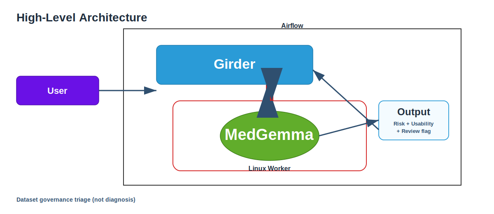

# From Upload to Research-Ready: Agentic Medical Data Governance with MedGemma

A privacy-first, local workflow for radiology DICOM governance triage using Girder, Apache Airflow, Linux worker execution, and MedGemma.

> **Safety statement:** This system does not perform diagnosis. It performs dataset governance triage.

---

## Demo Video

- **3-minute demo:** `https://youtu.be/gpgp817RGcQ`

---

## Architecture



**Figure:** User triggers from Girder, Airflow orchestrates processing, Linux worker runs MedGemma governance reasoning, and results are written back to Girder.

---

## Problem

Medical imaging datasets are difficult to reuse for research due to:
- anonymization uncertainty
- inconsistent metadata quality
- slow and expensive manual review workflows

This project automates governance triage to accelerate research readiness in privacy-sensitive environments.

---

## What We Built

A local agentic workflow that:
1. Starts from a Girder item action (`Run MedGemma Triage`)
2. Triggers Airflow DAG orchestration
3. Executes DICOM processing + MedGemma governance reasoning on Linux
4. Produces structured triage outputs back in Girder

**Governance outputs include:**
- anonymization risk
- research usability assessment
- manual review recommendation
- structured artifacts for auditability

---

## Key Components

- **Girder (Kitware):** dataset management, item actions, metadata/artifact storage
- **Apache Airflow:** orchestration, retries, status, cleanup
- **Linux Worker:** data extraction, file handling, model execution
- **MedGemma:** governance-oriented reasoning over representative medical images

---

## Prerequisites

- Python 3.10+
- MongoDB
- Girder server
- Apache Airflow 3.x (`api-server`, `scheduler`, `dag-processor`, `triggerer`)
- Linux worker reachable from orchestrator
- MedGemma model access/setup

---

## Installation

```bash
python3 -m venv .venv
source .venv/bin/activate
pip install -r requirements.txt
pip install -e .
```

---

## Environment Variables

```bash
AIRFLOW_URL=http://localhost:8080
AIRFLOW_ZIP_DAG_ID=girder_medgemma_pipeline
AIRFLOW_API_TOKEN=<YOUR_AIRFLOW_TOKEN>   # preferred
# OR fallback:
# AIRFLOW_USER=admin
# AIRFLOW_PASSWORD=admin

GIRDER_URL=http://localhost:8085
HUGGINGFACE_TOKEN=<YOUR_HF_TOKEN_IF_REQUIRED>
```

---

## Running

1. Start Airflow services (`api-server`, `scheduler`, `dag-processor`, `triggerer`)
2. Start Girder with Airflow environment variables
3. Upload DICOM ZIP in Girder
4. Click **Run MedGemma Triage**
5. Monitor run in Airflow and verify outputs in Girder

---

## Test Plan

- Airflow health check:

```bash
curl -i http://localhost:8080/api/v2/monitor/health
```

- Airflow DAG endpoint check:

```bash
curl -i -H "Authorization: Bearer <TOKEN>" "http://localhost:8080/api/v2/dags/girder_medgemma_pipeline"
```

- End-to-end test:
  - Trigger from Girder UI
  - Confirm DAG run in Airflow
  - Confirm output item appears in same folder
  - Confirm triage metadata + preview `.dcm`

---

## Limitations and Future Work

- Current implementation is a proof-of-concept focused on radiology DICOM workflows.
- Clinical validation is pending and required before clinical use.
- Future work includes clinician-guided validation, richer multimodal context, and larger-scale deployment.
